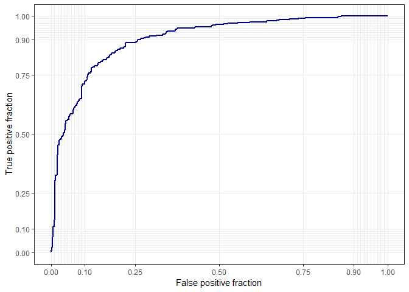
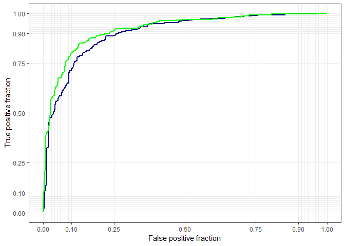

Alex Boyce
================
Your Name Goes Here
3/7/2019

This question refers to Chapter 9 Problem 8 beginning on page 371 in the text.

Create a training sample that has roughly 80% of the observations. Use set.seed(19823).

``` r
set.seed(19823)
df <- tbl_df(OJ)
inTraining <- createDataPartition(df$Purchase, p = .80, list = F)
training <- df[inTraining, ]
testing  <- df[-inTraining, ]
```

Use the `kernlab` package to fit a support vector classifier to the training data using `C = 0.01`.

``` r
OJ_svc <- ksvm(Purchase ~ ., data = training,
               type = "C-svc", 
               kernel = 'vanilladot',
               C = 0.01,
               prob.model = TRUE)
```

    ##  Setting default kernel parameters

Compute the confusion matrix for the training data. Report the overall error rates, sensitivity, and specificity.

``` r
confusionMatrix(table(predict(OJ_svc, newdata = testing), testing$Purchase), positive = "MM")
```

    ## Confusion Matrix and Statistics
    ## 
    ##     
    ##       CH  MM
    ##   CH 117  24
    ##   MM  13  59
    ##                                           
    ##                Accuracy : 0.8263          
    ##                  95% CI : (0.7686, 0.8746)
    ##     No Information Rate : 0.6103          
    ##     P-Value [Acc > NIR] : 7.121e-12       
    ##                                           
    ##                   Kappa : 0.6258          
    ##  Mcnemar's Test P-Value : 0.1002          
    ##                                           
    ##             Sensitivity : 0.7108          
    ##             Specificity : 0.9000          
    ##          Pos Pred Value : 0.8194          
    ##          Neg Pred Value : 0.8298          
    ##              Prevalence : 0.3897          
    ##          Detection Rate : 0.2770          
    ##    Detection Prevalence : 0.3380          
    ##       Balanced Accuracy : 0.8054          
    ##                                           
    ##        'Positive' Class : MM              
    ## 

Construct the ROC curve.

``` r
fits_svc <- predict(OJ_svc, newdata = training, type = "probabilities")
svc_pred <- mutate(training, 
                   svc_probs = fits_svc[, 2],
                   default = if_else(Purchase == "MM", 1, 0))

p <- ggplot(data = svc_pred, aes(d = default, m = svc_probs))
p + geom_roc(n.cuts = 0, col = "navy") + style_roc()
```



Use the `train` function from the `caret` package to find an optimal cost parameter (`C`) in the range 0.01 to 10. Use `seq(0.01, 10, len = 20)`.

``` r
fit_control <- trainControl(method = "repeatedcv",
                            number = 10, 
                            repeats = 3)

OJ_train <- train(Purchase ~ ., data = training,
                  method = "svmLinear", 
                  trControl = fit_control,
                  tuneGrid = data.frame(C = seq(0.01, 10, len=20)))
```

Compute the training and test classification error.

``` r
confusionMatrix(table(predict(OJ_train, newdata = training), training$Purchase), positive = "MM")
```

    ## Confusion Matrix and Statistics
    ## 
    ##     
    ##       CH  MM
    ##   CH 462  72
    ##   MM  61 262
    ##                                           
    ##                Accuracy : 0.8448          
    ##                  95% CI : (0.8188, 0.8684)
    ##     No Information Rate : 0.6103          
    ##     P-Value [Acc > NIR] : <2e-16          
    ##                                           
    ##                   Kappa : 0.6718          
    ##  Mcnemar's Test P-Value : 0.3859          
    ##                                           
    ##             Sensitivity : 0.7844          
    ##             Specificity : 0.8834          
    ##          Pos Pred Value : 0.8111          
    ##          Neg Pred Value : 0.8652          
    ##              Prevalence : 0.3897          
    ##          Detection Rate : 0.3057          
    ##    Detection Prevalence : 0.3769          
    ##       Balanced Accuracy : 0.8339          
    ##                                           
    ##        'Positive' Class : MM              
    ## 

``` r
confusionMatrix(table(predict(OJ_train, newdata = testing), testing$Purchase), positive = "MM")
```

    ## Confusion Matrix and Statistics
    ## 
    ##     
    ##       CH  MM
    ##   CH 114  20
    ##   MM  16  63
    ##                                           
    ##                Accuracy : 0.831           
    ##                  95% CI : (0.7738, 0.8787)
    ##     No Information Rate : 0.6103          
    ##     P-Value [Acc > NIR] : 2.296e-12       
    ##                                           
    ##                   Kappa : 0.6415          
    ##  Mcnemar's Test P-Value : 0.6171          
    ##                                           
    ##             Sensitivity : 0.7590          
    ##             Specificity : 0.8769          
    ##          Pos Pred Value : 0.7975          
    ##          Neg Pred Value : 0.8507          
    ##              Prevalence : 0.3897          
    ##          Detection Rate : 0.2958          
    ##    Detection Prevalence : 0.3709          
    ##       Balanced Accuracy : 0.8180          
    ##                                           
    ##        'Positive' Class : MM              
    ## 

Repeat (b) - (d) using an SVM with a polynomial kernel with degree 2.

``` r
OJ_svc_poly <- ksvm(Purchase ~ ., data = training,
               type = "C-svc", 
               kernel = 'polydot',
               kpar = list(degree = 2, scale = .1),
               C = 1,
               prob.model = TRUE)

fits_svm_d2 <- predict(OJ_svc_poly, newdata = training, 
                       type = "probabilities")
svc_pred_d2 <- mutate(svc_pred, svc_probs_d2 = fits_svm_d2[, 2])


confusionMatrix(table(predict(OJ_svc_poly, newdata = testing), testing$Purchase), positive = "MM")
```

    ## Confusion Matrix and Statistics
    ## 
    ##     
    ##       CH  MM
    ##   CH 115  25
    ##   MM  15  58
    ##                                           
    ##                Accuracy : 0.8122          
    ##                  95% CI : (0.7532, 0.8623)
    ##     No Information Rate : 0.6103          
    ##     P-Value [Acc > NIR] : 1.758e-10       
    ##                                           
    ##                   Kappa : 0.5964          
    ##  Mcnemar's Test P-Value : 0.1547          
    ##                                           
    ##             Sensitivity : 0.6988          
    ##             Specificity : 0.8846          
    ##          Pos Pred Value : 0.7945          
    ##          Neg Pred Value : 0.8214          
    ##              Prevalence : 0.3897          
    ##          Detection Rate : 0.2723          
    ##    Detection Prevalence : 0.3427          
    ##       Balanced Accuracy : 0.7917          
    ##                                           
    ##        'Positive' Class : MM              
    ## 

``` r
svc_pred_d2 <- mutate(svc_pred, svc_probs_d2 = fits_svm_d2[, 2])

fits_svc_poly <- predict(OJ_svc_poly, newdata = training, type = "probabilities")
svc_pred_poly <- mutate(svc_pred, 
                   svc_probs_poly = fits_svc_poly[, 2])

p <- ggplot(data = svc_pred_poly, aes(d = default, m = svc_probs))
p + geom_roc(n.cuts = 0, col = "navy") + 
  geom_roc(aes(d = default, m = svc_probs_poly), n.cuts = 0, col = "green") +
  style_roc()
```



1.  Which method would you choose? Poly

2.  Repeat (b) - (d) using an SVM with a radial basis kernel. Train it.

3.  Using the best models from LDA, SVC, SVM (poly), and SVM (radial), compute the test error.

4.  Which method would you choose?

<!-- -->

1.  Train one of the SVM models using a single core, 2 cores, and 4 cores. Compare the speedup (if any).
2.  You might want to look at `rbenchmark` or `microbenchmark` packages for timing.
